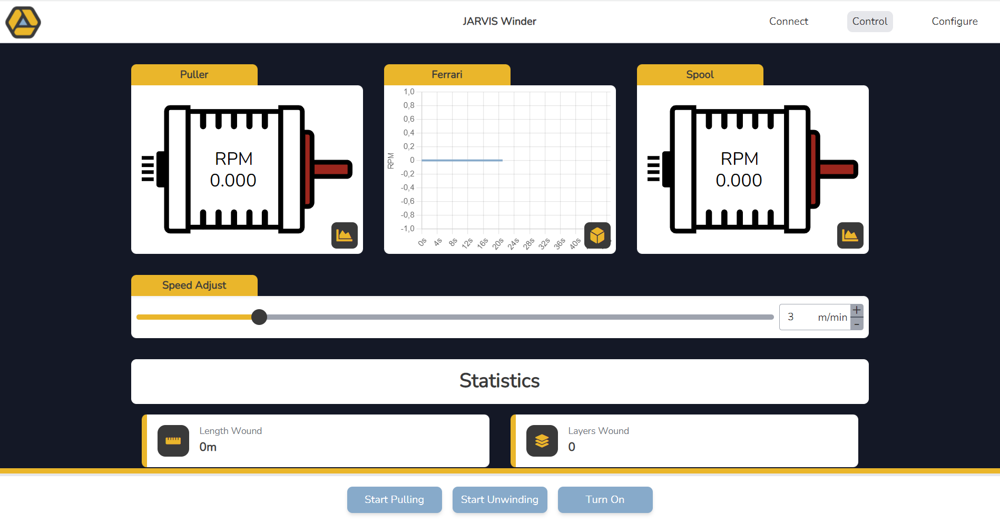

<div id="top"></div>

<!-- PROJECT SHIELDS -->
[![Contributors][contributors-shield]][contributors-url]
[![Issues][issues-shield]][issues-url]
[![Last Commit][commit-shield]][commit-url]
[![GPL-3.0 License][license-shield]][license-url]

<!-- PROJECT LOGO -->
<br />
<div align="center">
  <a href="https://github.com/QiTech-Industries/WinderWebInterface">
    
  </a>

  <h2 align="center">Jarvis Winder Webinterface</h2>

  <p align="center">
    The control interface to operate your winding machine remotly from your phone
    <br />
    <a href="https://github.com/QiTech-Industries/WinderWebInterface/tree/main/documentation"><strong>Explore the docs »</strong></a>
    <br />
    <br />
    <a href="https://github.com/QiTech-Industries/WinderWebInterface/issues">Report Bug</a>
    ·
    <a href="https://github.com/QiTech-Industries/WinderWebInterface/issues">Request Feature</a>
    ·
    <a href="https://github.com/QiTech-Industries">Related Projects</a>
  </p>
</div>


<!-- TABLE OF CONTENTS -->
<details>
  <summary>Table of Contents</summary>
  <ol>
    <li>
      <a href="#about-the-project">About The Project</a>
      <ul>
        <li><a href="#built-with">Built With</a></li>
      </ul>
    </li>
    <li>
      <a href="#getting-started">Getting Started</a>
      <ul>
        <li><a href="#installation">Installation</a></li>
      </ul>
    </li>
    <li><a href="#roadmap">Roadmap</a></li>
    <li><a href="#contributing">Contributing</a></li>
    <li><a href="#license">License</a></li>
    <li><a href="#contact">Contact</a></li>
  </ol>
</details>


<!-- ABOUT THE PROJECT -->
## About The Project



Every machine needs an option to control it. Instead of using a HMI Display or going with an onboard LCD, we decided to make our Winder controllable via Wifi. This way you can use your existing devices for control and it becomes more easy to develop the UI as it is just a PWA.

<p align="right">(<a href="#top">back to top</a>)</p>


### Built With

Because the internal ESP flash is with 1MB rather memory constrained we decided to go with Preact as frontend framework as it does not have a virtual DOM (and you can write `class` instead of `className` ;) and Tailwind CSS for styling so unnecessary styles are not compiled in the final build. (see more technology explanation in [Design Decisions](documentation/design_decisions.md))

| Library      | Info                              | License   |
| ------------ | --------------------------------- | --------- |
| Preact       | https://preactjs.com/             | MIT       |
| Tailwind CSS | https://tailwindcss.com/          | MIT       |
| Chart.js     | https://www.chartjs.org/          | MIT       |
| Zustand      | https://github.com/pmndrs/zustand | MIT       |
| FontAwesome  | https://fontawesome.com/          | CC BY 4.0 |
| Icomoon      | https://icomoon.io/               | CC BY 4.0 |

<p align="right">(<a href="#top">back to top</a>)</p>


<!-- GETTING STARTED -->
## Getting Started

To get a local copy up and running follow these simple steps.

### Installation

1. Clone the repo
   ```sh
   git clone https://github.com/QiTech-Industries/WinderWebInterface
   ```
2. Install NPM packages
   ```sh
   npm install
   ```
3. Start the application on port `8080` in hot-reload mode
   ```sh
   npm run dev
   ```
There is also a full mock server available to test the API interaction without having a connection to the Winder. To start it run:

1. Install NPM packages
   ```sh
   cd mock && npm install
   ```
2. Start the server on port `5001` in hot-reload mode
   ```sh
   npm run start
   ```

When reloading the webinterface a green toast should pop up notifying you that the socket connection was successful.

<p align="right">(<a href="#top">back to top</a>)</p>


<!-- ROADMAP -->
## Roadmap

This project is planned to run out of service soon as we realized that most people enjoy operating there machine via cable more than over wifi. This will also make it easier for us to implement synchronization between all our devices, as the PC running the new `Pro App` can act as a central host. Given that perspective we have no additional features planned for the interface. However the new software will stay compatible with older machines.

Issues and feature requests will still be kept track of.
See [open issues](https://github.com/QiTech-Industries/WinderWebInterface/issues) for a full list. Feel free to report new issues or fix existing ones.

<p align="right">(<a href="#top">back to top</a>)</p>


<!-- CONTRIBUTING -->
## Contributing

Contributions are what make the open source community such an amazing place to learn, inspire, and create. Any contributions you make are **greatly appreciated**.

If you have a suggestion that would make this better, please open a issue with the tag "enhancement" to discuss whether your idea is in line with our Roadmap and we can find the best way of implementing it.

Than:

1. Fork the Project
2. Create your Feature Branch (`git checkout -b feature/AmazingFeature`)
3. Commit your Changes (`git commit -m 'Add some AmazingFeature'`)
4. Push to the Branch (`git push origin feature/AmazingFeature`)
5. Open a Pull Request

<p align="right">(<a href="#top">back to top</a>)</p>


<!-- LICENSE -->
## License

Distributed under the GPL-3.0 License. See `LICENSE` for more information.

<p align="right">(<a href="#top">back to top</a>)</p>


<!-- CONTACT -->
## Contact

QiTech Industries - [https://qitech.de/industries](https://www.qitech.de/industries) - contact@qitech.de

Project Link: [https://github.com/QiTech-Industries/WinderWebInterface](https://github.com/QiTech-Industries/WinderWebInterface)

<p align="right">(<a href="#top">back to top</a>)</p>

<!-- MARKDOWN LINKS & IMAGES -->
<!-- https://www.markdownguide.org/basic-syntax/#reference-style-links -->
[contributors-shield]: https://img.shields.io/github/contributors/QiTech-Industries/WinderWebInterface?style=for-the-badge
[contributors-url]: https://github.com/QiTech-Industries/WinderWebInterface/graphs/contributors

[commit-shield]: https://img.shields.io/github/last-commit/QiTech-Industries/WinderWebInterface?style=for-the-badge
[commit-url]: https://github.com/QiTech-Industries/WinderWebInterface/commits

[issues-shield]: https://img.shields.io/github/issues/QiTech-Industries/WinderWebInterface?style=for-the-badge
[issues-url]: https://github.com/QiTech-Industries/WinderWebInterface/issues

[license-shield]: https://img.shields.io/github/license/QiTech-Industries/WinderWebInterface?style=for-the-badge
[license-url]: https://github.com/QiTech-Industries/WinderWebInterface/blob/main/LICENSE
